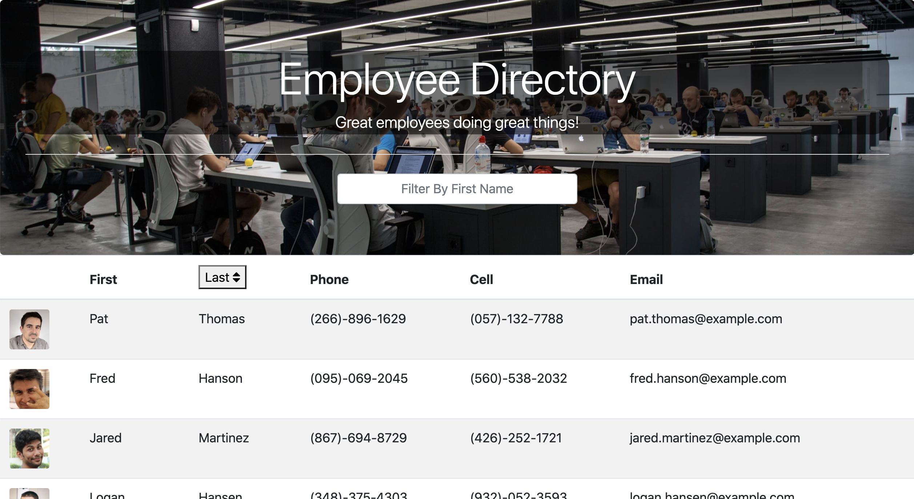
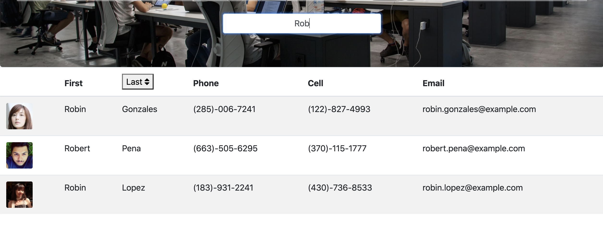

# Employee Directory 
  This App built with React.js uses axios to take JSON data of 200 employees from an API and render them into a table. The table can be filtered by employee's first name and sorted alphabetically by last name. 
  ## Table of Contents
  1. [Installation](#Installation)
  2. [Usage](#Usage)
  3. [Questions](#Questions)
  4. [Links & Images](#Links/Images)
  ## Installation
       For a local repo: Git clone and npm install
  ## Usage
  This app is meant to be used by the user who wants to view their entire employee directory at once so that they have quick access to employee information. The directory makes it easy to sort through and find the specific employee's information by their name. 
  ## Questions

  * GitHub: [VinAVarghese](https://github.com/VinAVarghese)
  * Email: [VinAVarghese@gmail.com](mailto:VinAVarghese@gmail.com)
  
  For any questions or comments, feel free to email me with the subject line RE: Employee Directory
  ## Links/Images
  [Click For Deployed Application](https://react-emp-dir-vav.herokuapp.com/)

  
  
